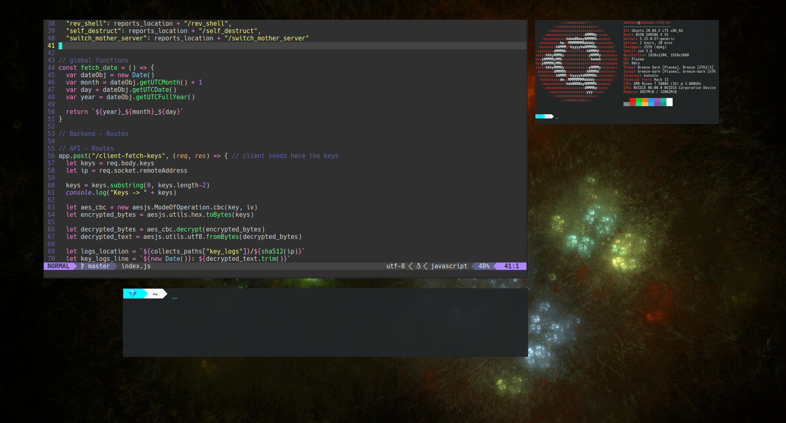

# Linux Config

Configuration files & scripts I usually use for my linux rice & work-station. 

This repository may include anything related to my style of ricing Linux. 

 

Files: 
 - `/config/i3-config.conf` goes into `~/.config/i3/config`
 - `/config/i3-bar-config.conf` goes into `/etc/i3status.conf`
 - `/config/vim-config.conf` goes into `~/.vimrc`
 - `/config/nvim/init.vim` goes into `~/.config/nvim/init.vim`
 - `/config/nvim/plugins.lua` goes into `/.config/nvim/lua/plugins.lua`
 - `/scripts/backup-manager.sh` is a script for backing up personal files, run it without arguments to get the help page 
 - `/scripts/start-i3.sh` is a script i use to start I3 on boot alongside KDE
