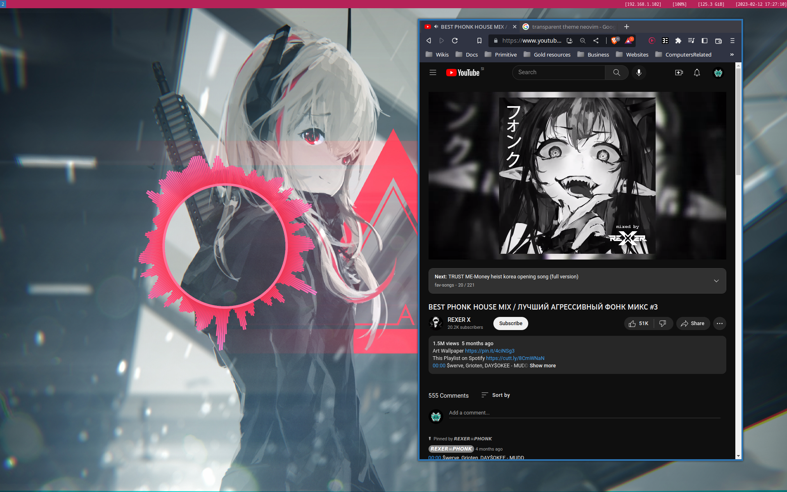
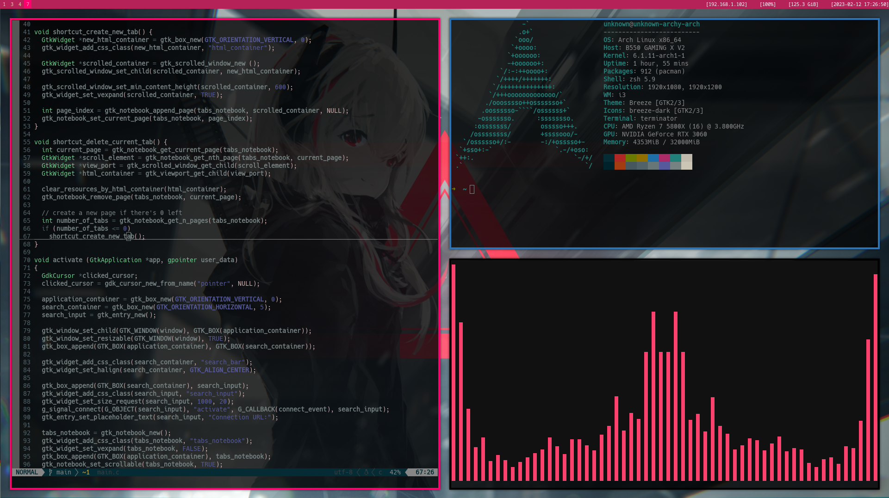

# Linux Config

Configuration files & scripts I usually use for my linux rice & work-station. 

This repository may include anything related to my style of ricing Linux. 

 
 

Specs: 
 - Arch Linux: I use arch btw! ;) 
 - I3: Tiling Window Manager
 - Picom (picom-animations-git fork): Transparent I3 windows and animations
 - I3lock: Lock the Desktop 
 - Glava: Background Audio Visualizer
 - Cava: Commandline Audio Visualizer
 - Neovim: Text editor
 - Nitrogen: Wallpaper setter

Files: 
 - `/config/i3-config.conf` goes into `~/.config/i3/config`
 - `/config/i3-bar-config.conf` goes into `/etc/i3status.conf`
 - `/config/picom/picom.conf` goes into `/etc/xdg/picom.conf` 
 - `/config/polybar` goes into `~/.config/polybar/` renamed as `shades` (modified theme from <a href="https://github.com/adi1090x/polybar-themes">adi1090x polybar-themes</a>
 - `/config/vim-config.conf` goes into `~/.vimrc`
 - `/config/nvim/init.vim` goes into `~/.config/nvim/init.vim`
 - `/config/nvim/plugins.lua` goes into `/.config/nvim/lua/plugins.lua`
 - `/config/glava/` goes into `~/.config/`
 - `/config/cava/config` goes into `~/.config/cava/config`
 - `/scripts/backup-manager.sh` is a script for backing up personal files, run it without arguments to get the help page 
 - `/scripts/start-i3.sh` is a script i use to start I3 on boot alongside KDE
